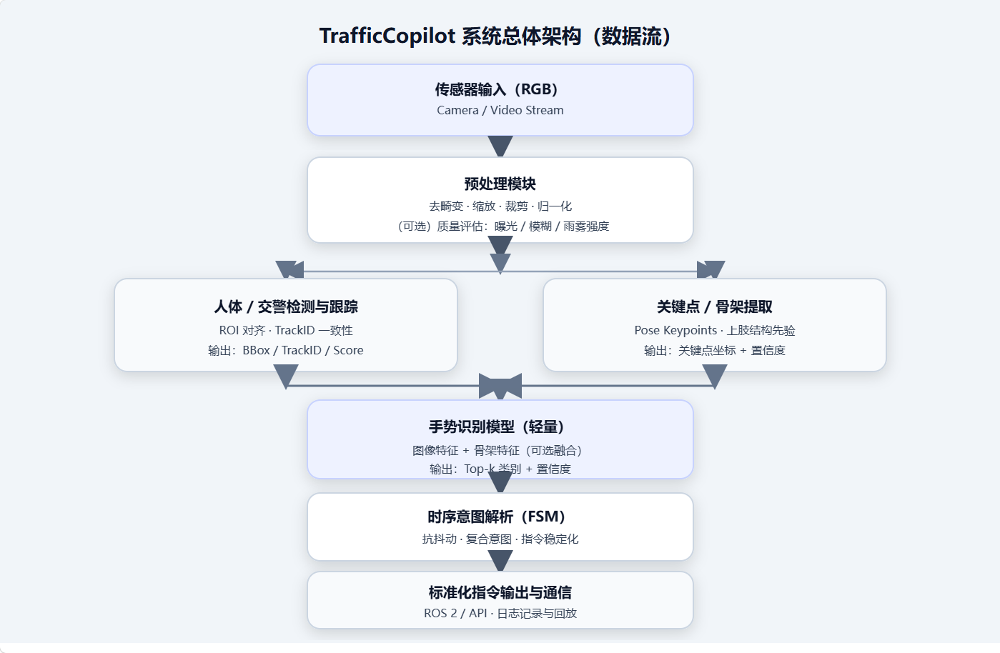

# 系统设计方案报告

## 题目

**TrafficCopilot：面向自动驾驶的鲁棒交警手势识别与时序意图解析系统设计方案**

## 团队简介

本团队由五位同学组成，均为**北京语言大学信息科学学院人工智能专业大三学生**。团队秉持“算法可落地、工程可集成、评估可复现”的研发原则，采用模块化分工与接口先行的协作方式，目标是完成一套可作为独立感知模块无缝接入无人驾驶平台的交警手势识别系统原型，并提供完整、可验证的技术方案。

## 研究背景

### 1. 自动驾驶的“固定设施依赖”与现实道路的“动态人工指挥”

近年来，智慧交通系统与无人驾驶技术取得了长足进步。高阶自动驾驶系统在结构化道路以及行为模式相对规范的交通参与者环境下，已能够较为稳定地处理红绿灯、车道线、交通标志牌等固定交通设施。然而，在真实城市道路场景中，交通组织并非总是由固定设施主导。当信号灯发生故障、道路临时封控、重大活动交通疏导、交通事故处理以及应急改道等情形出现时，**现场交警的手势指挥往往上升为通行规则中的最高优先级信息源**。

在人类驾驶行为中，驾驶员会自然地理解交警的动作所表达的动态交通规则，并在毫秒级时间内做出相应反应。然而，当前多数无人驾驶车辆即便搭载了多种传感器（如摄像头、激光雷达、毫米波雷达），仍然普遍缺乏对交警手势的稳定理解能力。这一能力缺失具体表现为：

- 在信号灯异常情况下，车辆无法正确遵从人工指挥，导致进退失据甚至违规通行；
- 在临时管制路口或事故现场，无法理解“停止”“放行”“待转”等复合意图，存在显著安全隐患；
- 面对连续手势序列（例如：先示意停止，再指示直行，随后引导左转待转）时，缺乏有效的时序建模能力，输出指令频繁抖动。

因此，“交警手势识别与意图解析”并非锦上添花的功能，而是自动驾驶系统在开放道路实现全天候、全场景运行能力所需解决的关键短板之一。如果该能力长期缺失，无人车的安全运行域（ODD）将在真实交通场景中出现根本性缺口，进而严重制约L4级自动驾驶的大规模落地进程。

### 2. 交警手势理解的本质：从视觉感知到可控指令的闭环

交警手势理解本质上不是一个单纯的图像分类问题，而是一个从原始视觉信号到可执行控制指令的完整工程闭环。该闭环至少包含以下五个核心环节：

1. **检测与定位**：在复杂背景中准确检测交警目标，并对关键区域（上肢、姿态）进行对齐；
2. **跟踪与一致性**：在视频流中维持目标身份标识（TrackID），抵抗遮挡与短时丢失带来的干扰；
3. **手势分类**：对单帧图像或短时片段进行手势类别的判别；
4. **时序意图解析**：对连续手势序列进行时空建模、稳定化处理，并推断其高层语义意图；
5. **标准化输出**：将识别结果转换为车辆控制域能够直接理解的结构化指令，同时附带置信度、状态信息以及失效处理策略。

只有将视觉识别结果真正与车辆决策/控制系统所需的指令形式对齐，才能实现无人车对人工交通指挥的可靠遵从，并建立人车之间的信任机制。

### 3. 关键挑战：鲁棒性与实时性的双重约束

交警手势识别在真实开放道路场景中面临着典型的“高噪声、强约束、强安全性”挑战，具体体现在以下几个方面：

- **复杂光照与恶劣天气**：逆光、夜间强眩光、雨雾、雪天、运动模糊以及视频压缩噪声等都会显著降低关键肢体的可见性，影响识别性能；
- **背景干扰与多目标混杂**：路口人流、车流密集，广告牌、反光衣、相似姿态的行人可能引发误检与误判；
- **个体差异与非标准动作**：不同交警的身形、着装、动作幅度和节奏存在差异，且实际指挥动作往往并不严格遵循“标准模板”；
- **时序语义复杂性**：同一通行指令可能由多个动作组合表达，且手势具有开始、保持、结束等不同阶段；系统必须有效抑制单帧噪声引起的指令抖动；
- **车端部署约束**：车载边缘计算平台的算力、功耗和带宽有限，要求模型轻量化，推理流水线高效，端到端延迟必须可控；
- **安全冗余与失效处理**：系统输出必须具有可解释性和可校验性，同时需要在“未知”或“不确定”情况下提供安全降级策略，避免错误指令导致事故。

上述挑战决定了本系统不能采用单一算法的堆叠方式，而必须采取“轻量化视觉模型 + 关键点辅助 + 时序稳定化 + 标准化接口”的综合技术方案。

## 研究内容

围绕“检测—跟踪—分类—意图解析—指令输出”的闭环逻辑，本系统的研究内容划分为五个层级：

1. **数据与标签体系**
   - 定义分层手势类别集合（基础手势类、复合意图类、未知类）；
   - 构建数据划分与版本管理策略（训练集/验证集/测试集、跨场景测试集）；
   - 设计面向鲁棒性的数据增强策略和难例集（雨雾、逆光、遮挡、远距离等场景）。
2. **交警目标检测与姿态辅助感知**
   - 实现交警/人体检测与ROI裁剪对齐；
   - 提取关键点/骨架信息，用于增强对上肢动作的判别能力。
3. **轻量化手势识别模型**
   - 设计轻量级骨干网络并引入注意力机制，提升对关键手臂区域的聚焦能力；
   - 研究图像特征与骨架特征的融合策略（早期/中期/晚期融合）。
4. **连续手势时序意图解析**
   - 基于滑动窗口与有限状态机（FSM）实现时序融合与抗抖动；
   - 支持复合意图解析与指令稳定化输出，避免频繁跳变。
5. **工程集成与通信接口**
   - 定义标准化输出指令格式、置信度及状态字段；
   - 设计面向无人驾驶平台的通信接口（ROS 2话题/服务或其他中间件）；
   - 实现性能监控、日志记录与可回放的数据闭环能力。

## 系统总体架构

本系统作为独立感知模块，接入上游相机视频流并向下游规划控制模块输出标准化指令。为保证实时性与可维护性，系统采用“多线程流水线 + 模块化接口”的架构设计。

## 核心模块设计

### 1) 输入与预处理模块

**职责**  
- 接收相机或视频流输入，统一分辨率、帧率与色彩空间；  
- 支持ROI裁剪、图像增强（仅用于训练/评估阶段）以及推理前的归一化操作；  
- 提供可选的质量评估输出（曝光度、模糊度、雨雾强度粗略估计），作为后续降级策略的判断依据。

**输入/输出**  
- 输入：`RGB frame`（建议附带时间戳及相机内参信息）  
- 输出：`preprocessed frame` + `meta`（包含尺寸、时间戳、质量指标等元信息）

### 2) 交警检测与跟踪模块

**职责**  
- 在复杂背景中准确定位“可能为交警”的人体目标；  
- 在视频流中维持TrackID，减少目标抖动与频繁重识别；  
- 输出对齐后的ROI区域，作为手势识别模块的主要输入。

**设计要点**  
- 检测：优先采用轻量级实时检测器或通用人体检测方案（工程上可从通用人体检测开始，再通过规则或特征过滤筛选出交警候选目标）；  
- 跟踪：使用轻量级跟踪器（如基于IOU/卡尔曼滤波的在线跟踪）实现TrackID的连续性；  
- 失效处理：短时丢失时采用“保持策略”，超时丢失则标记为`NO_TARGET`。

**输出**  
- `bbox`、`track_id`、`score`、`roi_frame`

### 3) 骨架关键点辅助模块

**职责**  
- 提取人体关键点（尤其关注上肢区域）的坐标信息，增强对手势几何结构的表达能力；  
- 在光照变化或背景干扰较大的情况下，提供更稳健的结构先验信息。

**设计要点**  
- 对关键点坐标进行归一化处理（相对于bbox或人体尺度），减小距离和缩放变化带来的影响；  
- 利用关键点置信度过滤异常姿态及遮挡帧；  
- 可选择性输出“上肢角度/方向”等派生特征，供融合模块或规则逻辑使用。

**输出**  
- `keypoints (x, y, score)` + `derived features`（可选）

### 4) 手势识别模型模块（轻量 + 注意力）

**职责**  
- 针对单帧或短片段完成手势类别预测，输出置信度分布；  
- 在保证精度的前提下兼顾鲁棒性与车端部署效率。

**关键算法思路**  
- 视觉主干：采用轻量级CNN或混合架构作为骨干网络；  
- 注意力机制：引入坐标注意力或通道注意力，强化模型对手臂区域的响应；  
- 双分支融合（可选）：在分类头之前融合图像特征与骨架特征，提升对姿态变化的泛化能力；  
- 输出：Top-k类别及其概率，并支持`unknown`类或开放集阈值策略。

**输出**  
- `gesture_probs`、`topk_gestures`、`confidence`

### 5) 时序意图解析模块（滑动窗口 + FSM）

**职责**  
- 将单帧手势预测结果转化为稳定、可执行的高层语义意图；  
- 解决短时误判、类别抖动以及复合指挥序列等工程难题。

**关键算法设计**  
- 滑动窗口融合：对近N帧的预测分布进行加权汇总（权重可基于置信度、关键点质量、目标稳定度等因素动态调整）；  
- 有限状态机（FSM）：  
  - 定义状态集合：`IDLE / DETECTING / HOLDING / COMMAND_ACTIVE / UNKNOWN`；  
  - 定义状态转移条件：连续K帧超过阈值才触发指令输出，连续M帧低于阈值则退出当前指令；  
  - 增加“最短保持时间”与“冷却时间”机制，防止指令频繁切换；  
- 复合意图解析：支持将基础手势映射为车辆控制语义（例如“停止待转”），并提供优先级规则。

**输出**  
- `intent_command`、`stability`、`reason`（可选，用于可解释性）

### 6) 指令标准化与对外接口模块

**职责**  
- 将识别出的意图映射为规划控制模块易于消费的结构化指令；  
- 提供标准通信接口（推荐ROS 2），并支持日志回放与离线评测。

**指令集合**  
- `STOP`：停车/停止通行  
- `GO_STRAIGHT`：直行放行  
- `TURN_LEFT`：允许左转/指示左转  
- `TURN_RIGHT`：允许右转/指示右转  
- `WAIT`：原地等待/待转  
- `UNKNOWN`：不确定/无效指令（触发安全降级）

**消息字段（建议）**

| 字段 | 含义 |
|---|---|
| `timestamp` | 输出时间戳（与输入对齐） |
| `track_id` | 目标跟踪ID（若存在） |
| `command` | 标准化指令枚举 |
| `confidence` | 指令置信度（0~1） |
| `source` | 来源（视觉/骨架/融合） |
| `latency_ms` | 端到端延迟（毫秒） |
| `status` | `OK / NO_TARGET / LOW_QUALITY / UNKNOWN` |

## 通信与数据流程

### 数据流（从输入到输出）

1. 相机节点发布`RGB frame`（附带时间戳）；  
2. 预处理模块生成标准化输入，并输出图像质量指标；  
3. 检测与跟踪模块输出交警候选ROI（含TrackID）；  
4. 骨架模块输出关键点信息（可选）；  
5. 识别模型输出单帧手势概率分布；  
6. 时序意图解析模块输出稳定化的`intent_command`；  
7. 接口模块发布标准化消息至下游规划控制模块。

### 通信机制

- 上游订阅：`/camera/image_raw`  
- 下游发布：`/traffic_copilot/intent`  
- 可选发布：`/traffic_copilot/debug`（用于可视化叠加关键点与bbox，便于演示与故障排查）  
- 可选服务：`/traffic_copilot/set_params`（用于动态调整阈值、窗口长度、工作模式等参数）

## 关键算法与工程策略（摘要）

1. **轻量化识别模型 + 注意力聚焦**  
   通过注意力机制增强模型对手臂区域的响应，提升在复杂背景下的特征可分性。  
2. **骨架关键点结构先验**  
   利用人体骨架的几何结构信息抵抗光照与纹理干扰，提高跨个体、跨场景的泛化能力。  
3. **滑动窗口融合与FSM稳定化**  
   抑制单帧噪声与瞬时误判，确保输出指令连续、稳定，符合车辆控制对时序一致性的要求。  
4. **开放集/未知类与安全降级**  
   当置信度不足时输出`UNKNOWN`指令，由车辆策略触发安全模式（减速、停车或提示人工接管）。  
5. **可部署推理链路**  
   支持导出ONNX格式模型，并结合主流推理加速框架实现端侧实时性能；同时记录延迟、吞吐量与资源占用情况。

## 拟采用的验证方法

### 1. 离线评测（准确性与鲁棒性）

**数据集与划分**  
- 采用公开手势数据集与自建的交警场景数据集（可包含真实路口截图/视频帧）；  
- 按场景划分：白天/夜间、晴天/雨雾、近/远距离、不同遮挡程度；  
- 保留独立测试集与“难例集”，用于最终性能展示。

**指标**  
- 分类指标：准确率、精确率/召回率、F1分数、混淆矩阵；  
- 鲁棒性指标：在退化条件下的性能保持率（相对于干净场景集的性能下降幅度）；  
- 开放集指标：未知类识别准确率、错误指令率（False Command Rate）。

### 2. 在线评测（实时性与稳定性）

- **端到端延迟**：采集输入时间戳与输出时间戳，统计P50/P90/P99延迟；  
- **吞吐与帧率**：在目标硬件或模拟环境下测量系统可达到的FPS；  
- **稳定性指标**：  
  - 指令抖动次数（单位时间内指令切换的次数）；  
  - 指令生效延迟（从手势开始到系统输出稳定指令的时间差）。

### 3. 消融实验（证明技术路线有效）

- 去掉骨架分支 vs. 融合骨架分支；  
- 去掉注意力模块 vs. 引入注意力模块；  
- 无时序稳定化 vs. 滑动窗口/FSM；  
- 不同阈值与窗口长度的敏感性分析。

### 4. 场景化验证（贴合实际路口）

设计若干典型场景用例并给出预期结果：  
- **信号灯故障**：交警交替指挥直行/停止，系统输出指令应与指挥动作一致且稳定；  
- **事故现场**：临时封控 + 单侧放行，系统应能正确输出`STOP`/`GO_STRAIGHT`并有效抑制误触发；  
- **夜间雨雾**：画面噪声显著增大时，系统应提升`UNKNOWN`输出比例，主动触发安全降级而非误导通行。

## 创新优势

1. **从“识别”到“意图”再到“可控指令”的闭环设计**  
   系统输出直接面向车辆控制域，包含置信度、状态信息与降级逻辑，强调工程可用性与安全性，不满足于单纯的分类精度。  
2. **结构先验与视觉特征融合**  
   引入骨架关键点作为辅助信息，有效增强系统在跨光照、跨背景、跨个体变化条件下的泛化能力。  
3. **轻量化 + 实时性优先的可部署路线**  
   以端侧部署为硬约束进行模型与流水线设计，避免出现“离线高精度、车端跑不动”的典型工程问题。  
4. **时序稳定化的可解释机制**  
   基于FSM和滑动窗口的融合策略具有可解释、可调参、可验证的特点，更加符合车规级安全工程的实践要求。  
5. **面向评审的可复现评测体系**  
   所采用的评价指标全面覆盖准确率、鲁棒性、延迟、稳定性以及误触发率，能够用定量数据支撑各项创新点的有效性。

## 下一步展望

1. **扩展类别与协议标准化**  
   进一步完善交警手势全集及复合语义定义，形成更细粒度的“交通指挥语言”映射表与接口规范。  
2. **更强的时序建模**  
   在保持轻量化的前提下，探索引入更强的序列模型（如轻量级Transformer或自适应滤波策略），提升对复杂连续指挥序列的理解能力。  
3. **跨城市/跨服装/跨摄像头泛化**  
   引入域适配与小样本增量学习方法，降低在不同采集条件下的数据成本，提升模型的迁移能力。  
4. **安全与冗余机制完善**  
   与车辆整体安全策略深度耦合，在不确定条件下提供“安全停靠/提示人工接管”等更高层次的安全建议。  
5. **从原型到车规级工程化**  
   完成更严苛的性能测试、异常工况测试以及接口一致性测试，推动系统在真实自动驾驶平台上的集成与验证。